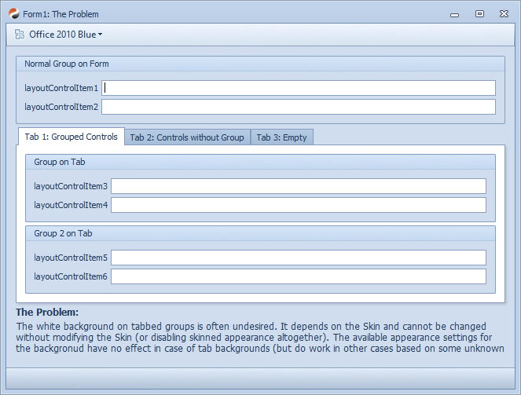
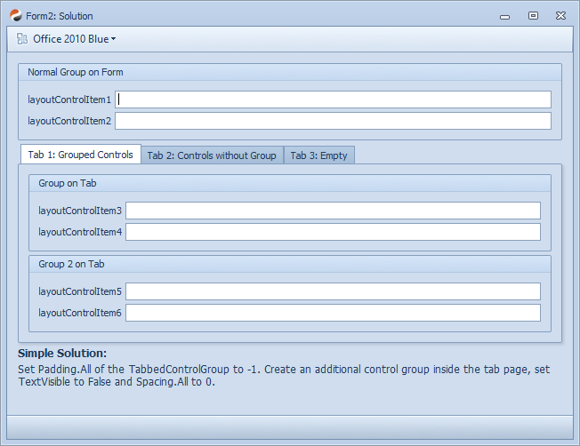
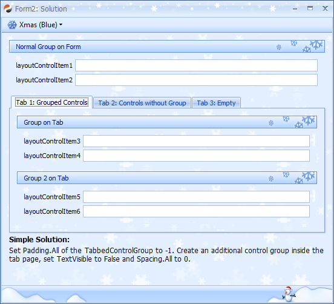
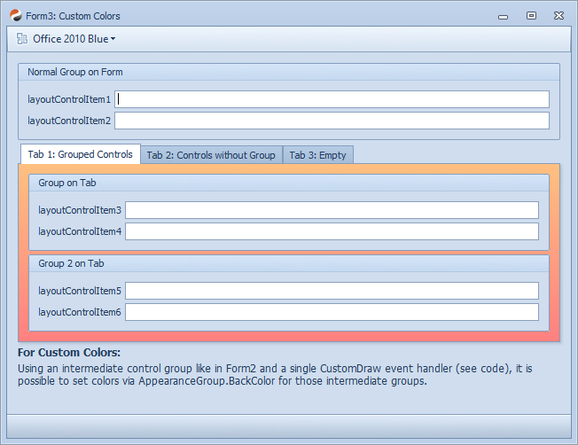
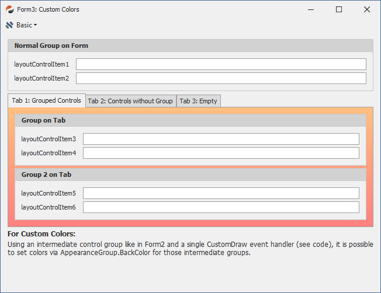
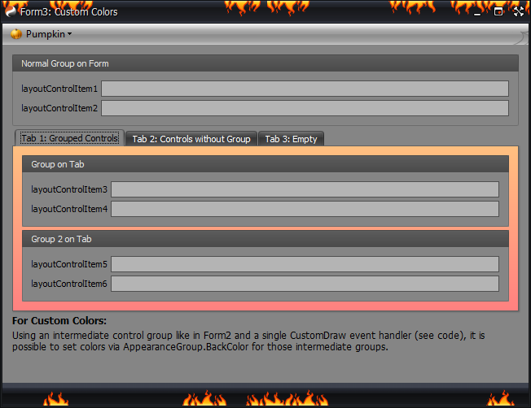

## DxUltimate Sample: LayoutControl - Back Color in Tabbed Group of DevExpress LayoutControl  

### 1. Introduction 

A question that frequently comes up is about how to change the background color in the layout control when using tabbed groups.
With certain Skins, this just doesn't look very nice in certain layouts like the white border around the groups on the tab page in this example:

### 2. The Problem

For more than a decade, the answer to those questions used to be the same:

*"The only way to change this is by modifying the Skin"*  
(or not using using the control in skinned mode)

Skins can be modified either upfront, which is a tedious job as it requires to create alternate skin dlls and register them instead of the original skins.
It is also possible to modify the corresponding skin element at runtime, but it's more a kind of a hack than a real solution and it might be difficult to even find out the right colors to set for each theme (in case multiple themes are being used).

This is not really a flexible solution as the skin color can be replaced by a single value only, which makes using multiple colors impossible.
Also, in case of some themes, it's not a color but a bitmap texture instead.
With all those caveats, this is not the path to a clean solution for that situation.

### 3. Solution

One way to solve this would be to subclass the control and adjust its painting mechanisms.

But this sample demonstrates an alternate method that is way easier than that and can be applied in almost no time to get this:

#### Result

#### Result with Bitmap Textures

#### How-To

- For better clarity, open the "Document Outline" Window in Visual Studio
- On the TabbedControlGroup (the element which has one or multiple tabs as descendants):
  Set `Padding.All` to `-1`
- For each tab-page: 
  (tab pages are direct descendants of the TabbedControlGroup)
  - Select all top-level items (now: direct descendants of the page)
  - If there's just a single one, temporarily add an additional item as a sibling
  - Right-Click the multi-selection and select **Group**
- On the new group:
  - Set `TextVisible` to `False`
  - Set `Spacing.All` to `0`

Done.

### 4. Custom Colors

We can use the same basic approach for having custom colors as tab page background.
The problem with the tab page control groups is that they don't fire any CustomDraw events,
but now that we have that extra control group in the tree, we can set

`item.AppearanceGroup.BackColor = Colors.Any;`

and add a few lines of code to handle the `LayoutControl.CustomDraw` event (please see sample project).

You can even set a BackColor2 value to show a gradient.

#### Results

### 5. Caveats

- The approach might not work well in combination with user customization as the additional control groups might be a bit confusing.
  It would still be possible to programmatically remove the extra groups when customization starts and re-add once customization is completed.
  This might work, but I haven't tried it
- The background color painting doesn't for regular groups directly
  (like the upper `LayoutControlGroup1`).
  But same as on a tab page, you could add a nested control group inside `LayoutControlGroup1`, then it would work in the same way.
